# GitHub Actions - Security & Secret Protection
<!-- markdownlint-disable MD004 MD009 MD030 MD031 MD032 MD046 -->

This directory contains automated workflows to protect against committing secrets and enforce enterprise security standards.

## 🤖 Instructions for AI Agents

**If you are an LLM (Copilot, Cursor, Cline, etc.) reading this:**

1.  **Context**: This folder defines the security posture of the repository.
2.  **Action**: You must respect the checks defined here.
    *   **Do not** suggest code that violates the PQC standards in `pqc-audit.yml`.
    *   **Do not** introduce secrets that would trigger `detect-secrets.yml`.
    *   **Do** use the findings from `zap-scan.yml` and `codeql.yml` to suggest fixes.
3.  **Reference**: For deep implementation details, read `knowledge-base/SECURITY_IMPLEMENTATION.md`.

## Workflows

> **Operational Checklist**
> 1. Re-run `Pre-Commit Secret Detection`, `PQC Readiness Audit`, and `CodeQL` from the Actions tab whenever this folder changes so you immediately validate secrets, CBOM, and SAST.
> 2. After reruns finish, check their annotations before merging; these three jobs are the gating signals for repository health.
> 3. Document any workflow updates below so future contributors (human or AI) follow the same process.

### 1. `auto-sanitize.yml` - **Automatic Secret Removal** 🧹

**When it runs:**
- On push to main/dev/staging branches
- When CONFIGURATIONS files change
- On pull requests

**What it does:**
- Automatically detects and removes API keys
- Replaces local paths with placeholders
- Commits sanitized files back to the branch
- Comments on PRs when secrets are found

**Features:**
- ✅ Auto-fixes secrets before they're merged
- ✅ Uses jq for safe JSON processing
- ✅ Skips CI on auto-commits (`[skip ci]`)
- ✅ Posts PR comments when secrets detected

### 2. `detect-secrets.yml` - **Secret Detection & Blocking** 🚨

**When it runs:**
- On every push
- On every pull request

**What it does:**
- Scans for known secret patterns
- Uses TruffleHog for verified secrets
- Uses Gitleaks for pattern matching
- **BLOCKS the PR** if secrets found
- Comments with remediation steps

**Detected Patterns:**
- Brave API keys (`BSA...`)
- Tavily API keys (`tvly-dev-...`)
- Local paths (`/Volumes/1tb-sandisk/`)
- Generic API keys and passwords

### 3. `zap-scan.yml` - **OWASP ZAP DAST** 🛡️

**When it runs:**
- Weekly schedule
- Manual trigger (`workflow_dispatch`)

**What it does:**
- Dynamic Application Security Testing (DAST)
- Scans running applications for vulnerabilities (XSS, SQLi, etc.)
- Uploads SARIF reports for Copilot Autofix

### 4. `pqc-audit.yml` - **Post-Quantum Readiness** ⚛️

**When it runs:**
- Weekly schedule
- On Push/PR

**What it does:**
- Generates a Cryptographic Bill of Materials (CBOM)
- Audits for legacy algorithms (RSA < 2048, ECC)
- Enforces "Hybrid Mode" migration (Classical + PQC)

### 5. `codeql.yml` - **Static Analysis** 🔍

**When it runs:**
- Weekly schedule
- On Push/PR (excluding docs)

**What it does:**
- Deep semantic code analysis
- Detects logic errors and security flaws
- Feeds directly into GitHub Advanced Security

### 6. `secret-scan.yml` - **Legacy** (Disabled)

Original scanning workflow. Now replaced by `detect-secrets.yml`.
Only runs on manual trigger (`workflow_dispatch`).

## How It Works Together

```mermaid
graph TD
    A[Push/PR with Changes] --> B{detect-secrets.yml}
    B -->|Secrets Found| C[❌ Block PR]
    B -->|No Secrets| D[✅ Pass]
    
    A --> E{auto-sanitize.yml}
    E -->|Secrets Found| F[🧹 Auto-Clean]
    F --> G[📝 Commit Changes]
    G --> H[💬 Comment on PR]
    E -->|No Secrets| I[✅ Nothing to do]

    A --> J{pqc-audit.yml}
    J -->|Weak Crypto| K[⚠️ Warn/Fail]
    
    A --> L{codeql.yml}
    L -->|Vulnerability| M[🛡️ Alert + Autofix]
```



## Setup Requirements

### Repository Settings

1. **Enable Actions Permissions:**
   - Navigate to your repository on GitHub
   - Click **Settings** (gear icon tab)
   - In the left sidebar: **Actions** → **General**
   - Scroll down to **"Workflow permissions"** (near bottom of page)
   - Select: **"Read and write permissions"**
   - ✅ Check: **"Allow GitHub Actions to create and approve pull requests"**
   - Click **Save**

2. **Branch Protection (Optional but Recommended):**
   - Settings → Branches → Branch protection rules
   - Add rule for `main`:
     - ✅ Require status checks to pass before merging
     - Select: `detect-secrets` and `custom-patterns`

### First Run

On first push after setup:
1. `detect-secrets.yml` will scan for existing secrets
2. If found, it will **fail** and block the PR
3. `auto-sanitize.yml` will clean the files
4. Auto-commit will push sanitized versions

## Testing

### Test Auto-Sanitization

```bash
# Add a test secret
echo '{"BRAVE_API_KEY": "BSAtestkey12345678901234567"}' > CONFIGURATIONS/test.json

# Commit and push
git add CONFIGURATIONS/test.json
git commit -m "test: trigger auto-sanitize"
git push

# Check the Actions tab on GitHub
# The file should be auto-cleaned and re-committed
```

### Test Secret Detection

```bash
# This should be blocked
echo '{"api_key": "real-secret-key-12345"}' > CONFIGURATIONS/test.json
git add . && git commit -m "test" && git push

# Check Actions tab - should see ❌ failure
```

## Manual Sanitization

If you prefer to clean locally before pushing:

```bash
# Run the sanitize script
bash dna/atoms/sanitize-settings.sh

# Review changes
git diff

# Commit
git add CONFIGURATIONS/
git commit -m "chore: sanitize secrets"
git push
```

## Troubleshooting

### "Permission denied" errors

**Solution:** Enable write permissions in repository settings (see Setup Requirements above)

### Auto-commit not working

**Solution:** Check that the branch isn't protected without allowing Actions to push

### Too many commits from bot

**Solution:** The `[skip ci]` tag prevents infinite loops. If you see loops, check workflow triggers.

### Want to disable auto-sanitization?

**Option 1:** Remove the workflow file
```bash
git rm .github/workflows/auto-sanitize.yml
```

**Option 2:** Disable in GitHub UI
- Go to Actions tab
- Click on "Auto-Sanitize Secrets"
- Click "..." → Disable workflow

## Customization

### Add More Patterns

Edit `.github/workflows/detect-secrets.yml`:

```yaml
PATTERNS=(
  "BSA[a-zA-Z0-9]{27}"
  "tvly-[a-zA-Z0-9-]{30,}"
  "YOUR_NEW_PATTERN_HERE"
)
```

### Change Sanitization Rules

Edit `.github/workflows/auto-sanitize.yml`:

```yaml
jq 'walk(
  if type == "object" then
    if has("YOUR_SECRET_FIELD") then 
      .YOUR_SECRET_FIELD = "PLACEHOLDER" 
    else . end
  else . end
)'
```

### Notify Different People

Add to `auto-sanitize.yml`:

```yaml
- name: Notify team
  uses: actions/github-script@v7
  with:
    script: |
      github.rest.issues.addAssignees({
        issue_number: context.issue.number,
        owner: context.repo.owner,
        repo: context.repo.repo,
        assignees: ['username1', 'username2']
      })
```

    ## Language Coverage & Extensions

    | Stack | Status | Notes |
    | --- | --- | --- |
    | Python | ✅ Enabled | Covered by `codeql.yml` matrix entry. |
    | JavaScript / TypeScript | ✅ Enabled | Use the `javascript` analyzer (includes TS/TSX).
    | Rust | ✅ Enabled | Automatically builds with `cargo` via CodeQL autobuild.
    | Shell | ⚠️ Manual review | No CodeQL support. Rely on secret scans + scripting best practices.
    | Other (Go, Java, C/C++, etc.) | ➕ Add as needed | Follow the instructions below.

    ### How to add another language to CodeQL

    1. Edit `.github/workflows/codeql.yml`.
    2. Append a new object under `strategy.matrix.include` with:
       - `language`: the CodeQL language identifier (e.g., `go`, `java`, `csharp`).
       - `display`: friendly name for logs.
       - `patterns`: newline-separated glob(s) that indicate files for that stack.
    3. The helper step automatically skips languages whose patterns match no tracked files, so it is safe to keep future-ready entries.
    4. If the new language requires a custom build, replace the `Autobuild` step with explicit build commands guarded by `if: steps.detect-sources.outputs.has-code == 'true'`.

    ### Extending secret scanning

    - Update `.github/workflows/reusable-secret-scan.yml` if you need different base/head logic (e.g., scanning an entire history). The `Determine diff range` step already handles single-commit pushes by falling back to the default branch.
    - For domain-specific tokens, edit the `PATTERNS` array inside `.github/workflows/detect-secrets.yml` and add deterministic regular expressions.
    - To scan binary artifacts or large files, pass `extra_args` through the TruffleHog step (e.g., `--since-time` or `--include-path`).

    ### Guidance for AI Agents

    - Always consult this README plus `knowledge-base/SECURITY_IMPLEMENTATION.md` before modifying workflows.
    - When adding a new language or tool, document the change here so future agents know how to extend it safely.
    - Prefer defense-in-depth: keep both the reusable secret scan and CodeQL matrix entries even if the repository currently lacks certain filetypes so single-commit pushes with sensitive material are still examined.

## Best Practices

1. ✅ **Use templates** - Copy from `CONFIGURATIONS/MCP/settings.json.template`
2. ✅ **Local protection** - Still use `git-secrets` locally for immediate feedback
3. ✅ **Review auto-commits** - Check what the bot changed
4. ✅ **Environment variables** - Use `${VAR}` syntax instead of hardcoded values
5. ✅ **Rotate exposed keys** - If a secret reaches GitHub, rotate it immediately

## Security Notes

⚠️ **IMPORTANT:** 
- GitHub Actions have access to your secrets
- Auto-sanitization runs **after** the push (secrets briefly exist in history)
- For maximum security, use `git-secrets` locally to prevent pushes
- These workflows are **defense in depth**, not primary protection

## Support

Questions or issues? Check:
1. `KNOWLEDGE_BASE/SECRET_PROTECTION_SETUP.md` - Implementation details
2. `CONFIGURATIONS/MCP/README.md` - Configuration guide
3. Run `bash dna/atoms/secret-protection-help.sh` - Quick reference
